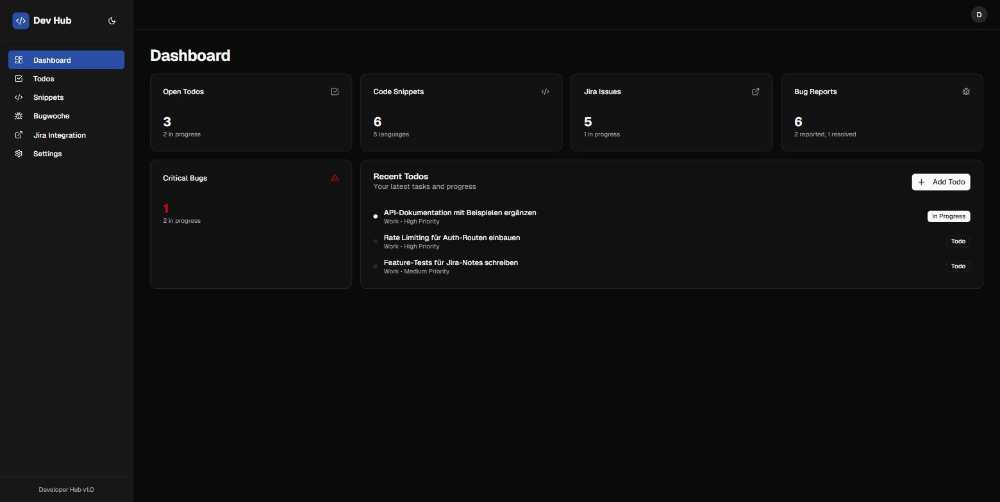
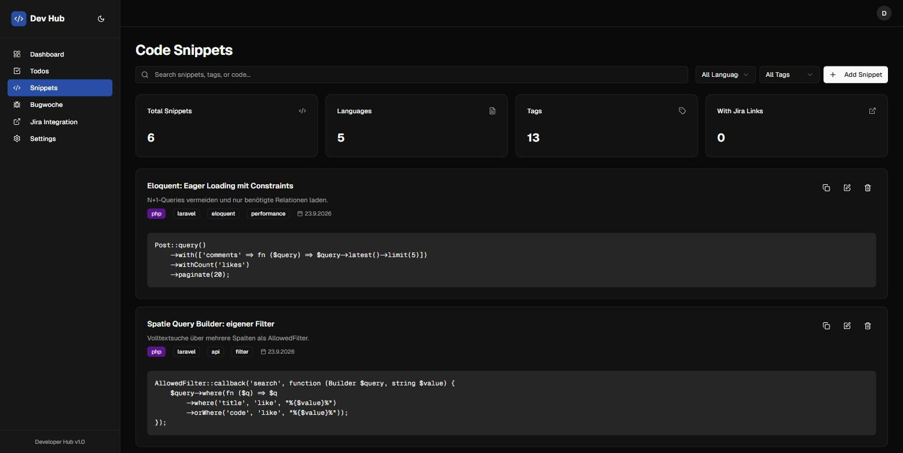
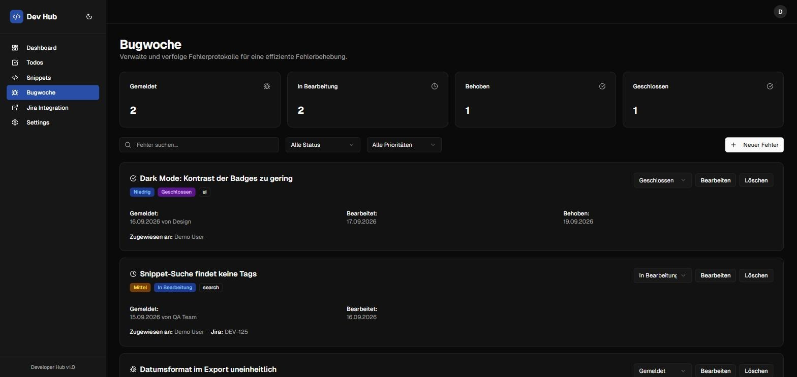
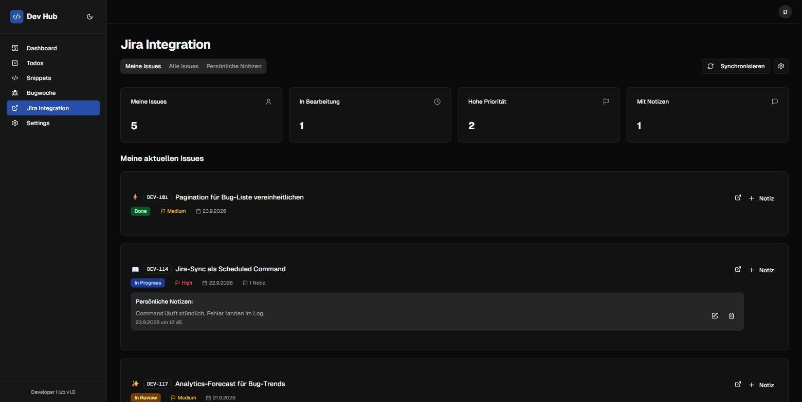

# Developer Hub – Frontend

Web-Oberfläche für die [Dev Hub API](https://github.com/QuitScope/dev-hub): ein persönliches Developer-Dashboard mit Todos, Code-Snippets, Bug-Tracking und Jira-Anbindung.



| Code-Snippets | Bug-Tracking |
| --- | --- |
|  |  |

| Jira-Integration |
| --- |
|  |

## Funktionen

- **Dashboard**: Kennzahlen zu offenen Todos, Snippets, Bugs und Jira-Issues auf einen Blick
- **Todos**: Aufgaben nach Kategorie, Status und Priorität filtern und bearbeiten
- **Snippets**: Code-Schnipsel mit Sprache und Tags speichern, durchsuchen und kopieren
- **Bugwoche**: Fehlerberichte mit Status-Workflow, Reporter und Zuständigkeit
- **Jira**: Eigene Issues synchronisieren und persönliche Notizen anlegen
- **Auth**: Login und Registrierung über Token (Laravel Sanctum)
- **Dark Mode**

## Tech-Stack

- Next.js 15 (App Router), React 19, TypeScript
- Tailwind CSS 4, shadcn/ui (Radix UI)

## Lokal starten

Voraussetzung: Die [Dev Hub API](https://github.com/QuitScope/dev-hub) läuft lokal (Standard: `http://localhost:8000`).

```bash
pnpm install
cp .env.example .env.local
pnpm dev
```

Dann http://localhost:3000 öffnen. Mit dem `DemoSeeder` der API kannst du dich als `demo@devhub.test` / `password` anmelden.

| Variable | Beschreibung |
| --- | --- |
| `NEXT_PUBLIC_API_BASE_URL` | Basis-URL der API, ohne `/api`-Präfix |

## Projektstruktur

```
app/            # Seiten (App Router)
components/     # Feature-Komponenten (todo-manager, bug-tracker, …)
components/ui/  # UI-Basiskomponenten
lib/            # API-Client, Auth-Context, Konfiguration
hooks/
```

## Lizenz

MIT
